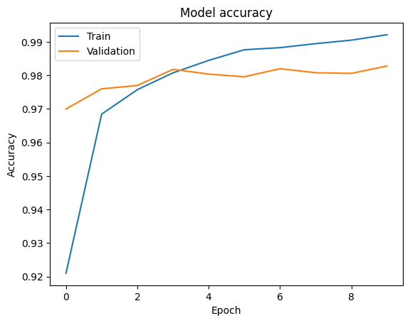
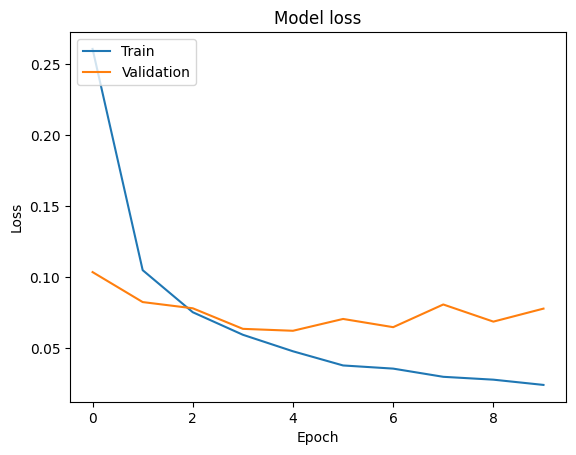
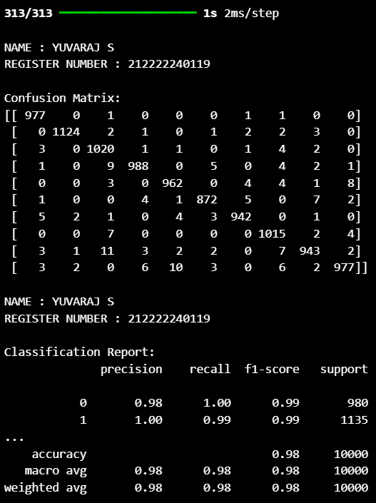
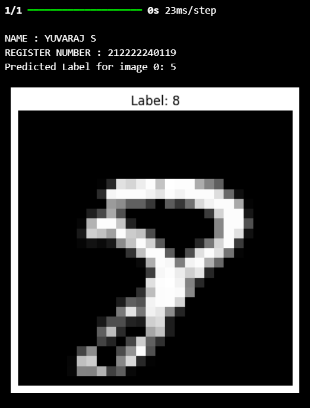

## Project Based Experiments
## Objective :
 Build a Multilayer Perceptron (MLP) to classify handwritten digits in python
## Steps to follow:
## Dataset Acquisition:
Download the MNIST dataset. You can use libraries like TensorFlow or PyTorch to easily access the dataset.
## Data Preprocessing:
Normalize pixel values to the range [0, 1].
Flatten the 28x28 images into 1D arrays (784 elements).
## Data Splitting:

Split the dataset into training, validation, and test sets.
Model Architecture:
## Design an MLP architecture. 
You can start with a simple architecture with one input layer, one or more hidden layers, and an output layer.
Experiment with different activation functions, such as ReLU for hidden layers and softmax for the output layer.
## Compile the Model:
Choose an appropriate loss function (e.g., categorical crossentropy for multiclass classification).Select an optimizer (e.g., Adam).
Choose evaluation metrics (e.g., accuracy).
## Training:
Train the MLP using the training set.Use the validation set to monitor the model's performance and prevent overfitting.Experiment with different hyperparameters, such as the number of hidden layers, the number of neurons in each layer, learning rate, and batch size.
## Evaluation:

Evaluate the model on the test set to get a final measure of its performance.Analyze metrics like accuracy, precision, recall, and confusion matrix.
## Fine-tuning:
If the model is not performing well, experiment with different architectures, regularization techniques, or optimization algorithms to improve performance.
## Visualization:
Visualize the training/validation loss and accuracy over epochs to understand the training process. Visualize some misclassified examples to gain insights into potential improvements.

# Program:
## DEVELOPED BY : YUVARAJ S
## REGISTER NUMBER : 212222240119
```PY
import tensorflow as tf
from tensorflow.keras import layers, models
from tensorflow.keras.datasets import mnist

(train_images, train_labels), (test_images, test_labels) = mnist.load_data()

train_images = train_images / 255.0
test_images = test_images / 255.0

train_images = train_images.reshape((-1, 28 * 28))
test_images = test_images.reshape((-1, 28 * 28))

validation_images = train_images[:5000]
validation_labels = train_labels[:5000]
train_images = train_images[5000:]
train_labels = train_labels[5000:]

model = models.Sequential([
    layers.Dense(512, activation='relu', input_shape=(28 * 28,)),
    layers.Dropout(0.2),
    layers.Dense(512, activation='relu'),
    layers.Dropout(0.2),
    layers.Dense(10, activation='softmax')
])

model.compile(optimizer='adam',
              loss='sparse_categorical_crossentropy',
              metrics=['accuracy'])

history = model.fit(train_images, train_labels, epochs=10, batch_size=128,
                    validation_data=(validation_images, validation_labels))

test_loss, test_acc = model.evaluate(test_images, test_labels)
print('Test accuracy:', test_acc)
import matplotlib.pyplot as plt

plt.plot(history.history['accuracy'])
plt.plot(history.history['val_accuracy'])
plt.title('Model accuracy')
plt.ylabel('Accuracy')
plt.xlabel('Epoch')
plt.legend(['Train', 'Validation'], loc='upper left')
plt.show()

plt.plot(history.history['loss'])
plt.plot(history.history['val_loss'])
plt.title('Model loss')
plt.ylabel('Loss')
plt.xlabel('Epoch')
plt.legend(['Train', 'Validation'], loc='upper left')
plt.show()
import numpy as np
from sklearn.metrics import confusion_matrix, classification_report

# Generate predictions for the test set
predictions = model.predict(test_images)
predicted_labels = np.argmax(predictions, axis=1)

# Confusion Matrix
conf_matrix = confusion_matrix(test_labels, predicted_labels)
print("\nNAME : YUVARAJ S\nREGISTER NUMBER : 212222240119\n")
print("Confusion Matrix:")
print(conf_matrix)

# Classification Report
class_report = classification_report(test_labels, predicted_labels)
print("\nNAME : YUVARAJ S\nREGISTER NUMBER : 212222240119")
print("\nClassification Report:")
print(class_report)

def predict_single_image(image):
    image = image.reshape(1, 28 * 28)
    image = image / 255.0
    prediction = model.predict(image)
    predicted_label = np.argmax(prediction)
    print("\nNAME : YUVARAJ S\nREGISTER NUMBER : 212222240119")
    return predicted_label

image_index = 0
predicted_label = predict_single_image(test_images[image_index])
print("Predicted Label for image {}: {}".format(image_index, predicted_label))

def visualize_random_image(images, labels):
    idx = np.random.randint(0, len(images))
    img = images[idx]
    label = labels[idx]
    img = np.reshape(img, (28, 28))
    plt.imshow(img, cmap='gray')
    plt.title(f'Label: {label}')
    plt.axis('off')
    plt.show()

visualize_random_image(test_images, test_labels)
```


## Output:
### Train and Validation - ACCURACY

### Train and Validation - LOSS

### Confusion matrix and Classification report :

### Prediction : 



